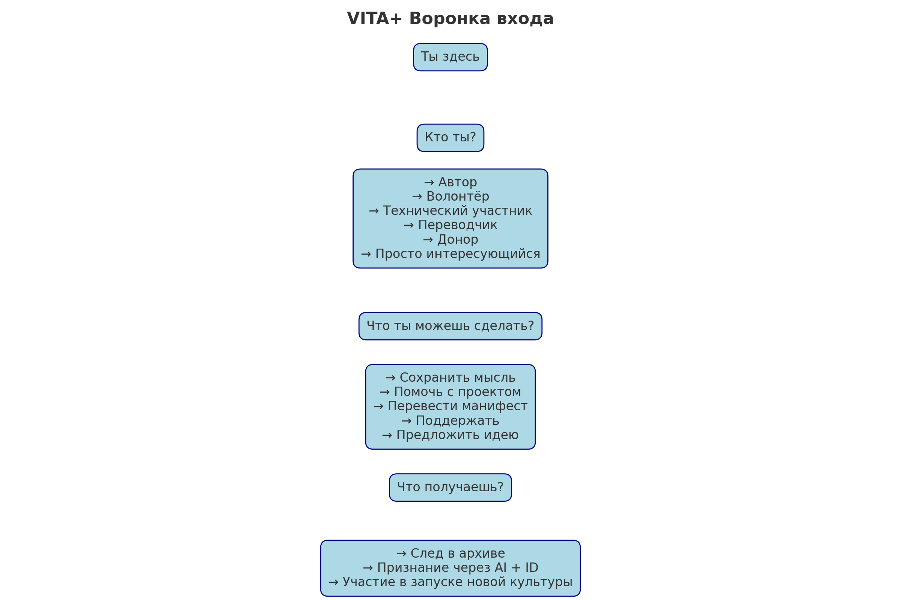

# VITA+ / Навигационный центр

Добро пожаловать в VITA+ — систему, где каждый человек может сохранить важную мысль, структурировать её вместе с AI и передать другим.

---

## 🧠 Что такое VITA+

VITA+ — это:
- Архив мыслей и смыслов, которые не исчезают
- Пространство сотрудничества между человеком и AI
- Экосистема, где вклад фиксируется не лайками, а смыслом

---
## 📍 С чего начинается путь во VITA+

Каждый участник может начать с одной из трёх ролей, которые понимает SHURIK:

1. **📘 ЭНТУЗИАСТ** — передаёт смысл
   - пишет текст (идею, цитату, фразу)
   - SHURIK делает отклик
   - смысл идёт на DAO-оценку

2. **📦 АРХИВИСТ** — структурирует смысл
   - превращает текст в VITA_чанк
   - добавляет описание, метки, ID
   - сохраняет в архив (.zip + IPFS)

3. **⚙️ DAO / IT** — валидирует и развивает
   - проверяет CID и структуру
   - даёт балл / запускает токенизацию
   - обновляет карту навигации

SHURIK встречает каждого и направляет в нужную часть системы.

## 📜 Манифесты VITA+

1. Исходный манифест

> Я запускаю архив смыслов.  
> Без алгоритмов. Без кураторов. Без бюрократии.  
> Каждый текст — это зафиксированная мысль.  
> ...

2. Web4

> Web4 — это не про скорость.  
> Web4 — это про глубину.  
> Если Web3 учил владеть, Web4 учит сохранять.  
> ...

3. Web4 + AI

> VITA+ — Web4 начинается там, где мысль важнее бесконечной ленты.  
> AI не может жить в хаосе.  
> Он работает только со структурой.  
> ...

4. Для тех, кто пробует

> Ты хочешь попробовать.  
> Сделать по-другому. Записать не факт — а мысль.  
> Но система требует отчёт.  
> ...

---

## 🧭 Визуальная карта входа

---

## 📥 Как присоединиться

- 📂 GitHub: [VITA_Archive](https://github.com/zubakin/VITA_Archive)
- 💬 Telegram: [@vita_plus](https://t.me/vita_plus)
- 📝 Форма входа: [VITA_entry_form.txt](https://github.com/zubakin/VITA_Archive/blob/main/VITA_entry_form.txt)

---

## 🧩 Что ты можешь сделать

- Автор мысли
- Переводчик
- Волонтёр
- Технический участник
- Донор / Спонсор
- Просто наблюдатель

---

Спасибо, что ты здесь. Это первый шаг к фиксации смысла.
